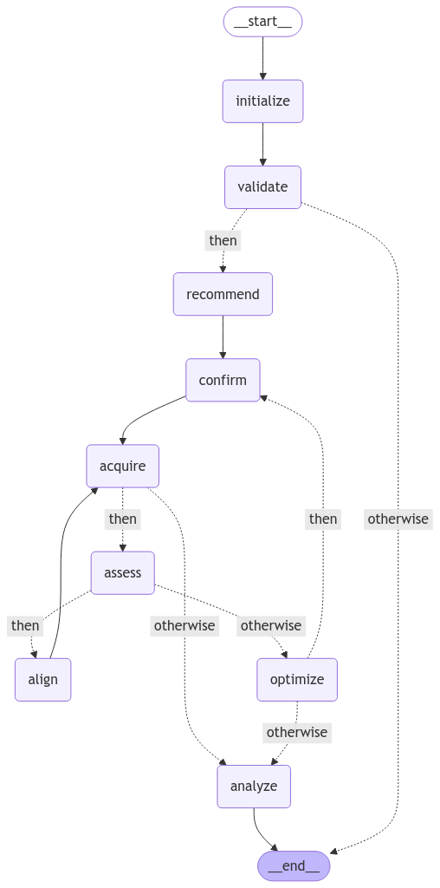

> [!NOTE]
> This project was initially developed during the [AI and ML for Microscopy Hackathon](https://kaliningroup.github.io/mic-hackathon/).

> [!WARNING]
> Under development, breaking changes will occur without notice.

# AutoScriptCopilot

This repository contains a state machine-based workflow for automated Transmission Electron Microscope (TEM) experiment control, built using the [`nodeology`](https://github.com/xyin-anl/Nodeology) framework and Thermo Fisher's [AutoScript](https://www.thermofisher.com/us/en/home/electron-microscopy/products/software-em-3d-vis/autoscript-tem-software.html) interface.

## Overview

The workflow automates TEM imaging experiments by managing microscope setup, parameter optimization, image acquisition, and quality assessment. It leverages foundation AI for parameter recommendations and image quality analysis while maintaining precise control over microscope operations through AutoScript.

## Why State Machines?

TEM experiments present unique challenges that make state machine architecture particularly advantageous:

1. **Complex State Management**: TEM experiments involve multiple interdependent parameters (vacuum state, beam conditions, detector status, optical settings) that must be tracked and validated throughout the experiment.

2. **Conditional Workflows**: Experiment progression often depends on intermediate results (e.g., image quality metrics) requiring dynamic decision-making.

3. **Error Recovery**: State machines facilitate robust error handling and recovery, crucial for expensive TEM sessions.

4. **Human-in-the-Loop**: The architecture naturally supports expert intervention at critical decision points while maintaining workflow automation.

## Why Nodeology?

Nodeology was chosen as the framework for several reasons:

1. **Foundation AI Integration**: Seamlessly incorporates AI-driven components (context retrieval, parameter recommendation, quality assessment etc.) with traditional microscope control logic.

2. **Composable Architecture**: Enables modular design where each experimental step is an independent node, making the workflow easy to modify and extend.

3. **Built-in Templates**: Supports workflow templating, allowing sharing of experimental protocols while protecting sensitive implementations.

4. **Type Safety**: Provides strict type checking through state definitions, crucial for maintaining experimental reproducibility.

## Why AutoScript?

AutoScript provides several key advantages for TEM automation:

1. **Direct Control**: Offers low-level access to microscope functions through a Python API, enabling precise control over instrument parameters.

2. **Comprehensive Coverage**: Supports full range of TEM operations including:

   - Optical system control (beam settings, alignment)
   - Detector management
   - Image acquisition
   - Auto-functions (focus, stigmation)

3. **Integration Support**: Well-documented Python interface that integrates smoothly with other scientific computing tools.

## Workflow Design

### State Management

The workflow maintains a comprehensive state (`TEMState`) tracking:

```python
class TEMState(State):
    # Microscope
    microscope_id: str
    microscope_info: Dict[str, str]

    # System status
    vacuum_state: str
    beam_state: bool
    detector_status: Dict[str, bool]

    # Optical settings
    magnification: float
    focus: float
    stigmator_values: Dict[str, float]

    # Acquisition settings
    exposure_time: float
    frame_size: int
    detector_type: str
    trial_mode: bool
    direct_mode: bool

    # Knowledge
    recommender_knowledge: str
    data_analysis_tool: str
    trial_mode_detector_type: str

    # Results
    current_image: str
    image_quality_metrics: Dict[str, float]
    optimization_history: List[Dict]
    validation_response: Dict
    updated_parameters: Dict
    data_analysis_results: Dict
```

### Core Components

1. **Initialization & Validation**

   - Microscope connection setup
   - System state validation
   - Parameter recommendation based on knowledgebase

2. **Image Acquisition Loop**

   - Parameter confirmation/modification
   - Image acquisition
   - Quality assessment
   - Auto-alignment if needed
   - Parameter optimization

3. **Analysis & Results**
   - Data analysis based on experimental objectives
   - Result storage and reporting

### Key Nodes

1. `validate_setup`: Validates microscope readiness
2. `parameter_recommender`: AI-driven parameter recommendation
3. `acquire_image`: Handles image acquisition through AutoScript
4. `auto_align`: Manages microscope alignment procedures
5. `quality_assessor`: AI-based image quality analysis
6. `parameter_optimizer`: Optimizes parameters based on quality metrics
7. `data_analysis`: Processes experimental results

## Usage

### Prerequisites

- Python 3.10+
- AutoScript TEM Software
- Required Python packages including `nodeology` (see requirements.txt)

### Basic Usage

```python
# Initialize workflow
workflow = TEMWorkflow(
    state_defs=TEMState,
    llm_name="gpt-4o",
    vlm_name="gpt-4o",
)

# Define initial parameters
initial_state = {
    "magnification": 20000,
    "focus": 0.0,
    "exposure_time": 0.1,
    "frame_size": 2048,
    "detector_type": "empad",
    "trial_mode_detector_type": "haadf",
    "recommender_knowledge": expert_knowledge
}

# Run workflow
result = workflow.run(initial_state)
```

### Workflow Visualization

The workflow can be visualized using:

```python
workflow.graph.get_graph().draw_mermaid_png(output_file_path="tem_workflow.png")
```

<div align="center">
  
  <h3></h3>
</div>

Note that `graphviz` need to be installed in the system and python package `pygraphviz` is needed.

### Template Export

Experimental protocols can be shared via YAML templates:

```python
workflow.to_yaml("tem_workflow.yaml")
```

## Best Practices

1. **Parameter Management**

   - Start with conservative parameter values
   - Use trial mode for initial parameter testing
   - Validate parameters before full acquisition

2. **Quality Control**

   - Define clear quality metrics
   - Set appropriate thresholds for auto-alignment
   - Document optimization decisions

3. **Data Management**
   - Use consistent naming conventions
   - Store raw data and metadata
   - Track parameter optimization history
